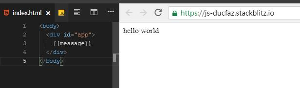
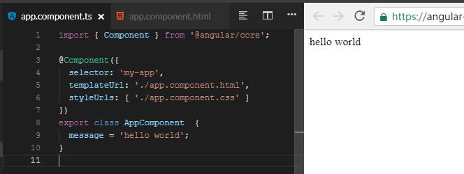
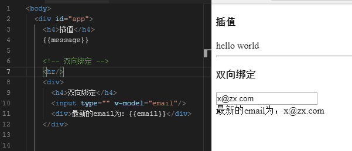
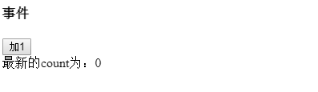
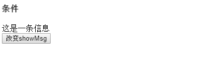
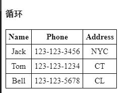
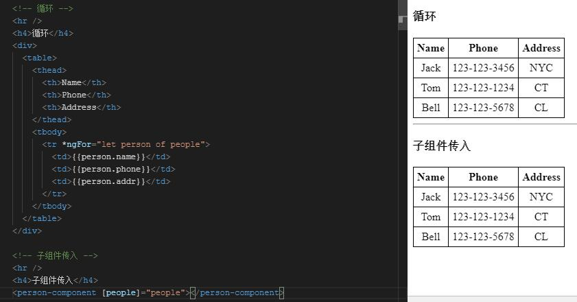

# angular-vue
（施工中）
---
**学习Vue过程中，记下与Angular相比较的笔记**

### 开发环境
---
```
VS Code
Win-10 v1903
NodeJs: v10.14.1
npm: 6.4.1
angular/cli: 8.3.20
rxjs: 6.4.0
```

### 安装
---
#### Angular:

Angular的起源这里只简单的介绍一下，有兴趣的可以自行搜索。

AngularJs诞生于2009年，起先也是类似于现在VueJs一样的，只需要html页面中导入相应的script库，即可使用，有兴趣的可以稍微看看我的[AngularJS-1.6.6-Tutorial](https://github.com/xky0007/AngularJS-1.6.6-Tutorial#angularjs-166-tutorial)稍作了解。

从Angular2开始，Angular变成了一个完整的前端框架且主要使用TypeScript。之后为了与之前的AngularJs区分并且对Angular本身进行了很大的改变，跨过了Angular3，直接到了Angular4，并且计划每半年发布一次新版本。至今已是Angular8 （Angular9照计划应该已经推出，但是每次都会晚一些）。

1. 安装Angular需要首先安装NodeJs和npm，搜索一下nodejs即可找到安装包，windows下npm也会随着nodejs安装，安装完成后使用```node --version```和```npm --version```检查是否安装成功。
2. 打开终端（cmd,powershell,windows terminal都可以)，运行```npm install -g @angular/cli```，等待安装结束
3. 运行```ng --version```查看是否安装成功

#### vuejs

只有一步，导入```<script src="https://cdn.jsdelivr.net/npm/vue"></script>```即可。

### 使用
---
由于本人之前只用过Angular，vue的经验不多，具目前的使用来看大概分为几个部分，我将一一对比Angular和vuejs的代码。所有的代码我都会放在stackblitz: [vuejs](https://stackblitz.com/edit/js-ducfaz)和[angular](https://stackblitz.com/edit/angular-gswt3k)

*[1. 插值](#s1)

*[2. 双向绑定](#s2)

*[3. 组件事件](#s3)

*[4. 条件、循环调用组件和组件复用](#s4)

*[5. 将值传入子组件](#s5)

*[6. 子组件事件上浮至父组件](#s6)

<h4 id="s1">1. 插值<h4>

##### Vuejs:

index.html
```
<body>
	<div id="app">
		{{message}}
	</div>
</body>
```

index.js
```
// Import stylesheets
import './style.css';
import Vue from 'vue'

// Write Javascript code!
var vm = new Vue({
  el:'#app', //绑定到id为app的元素，不可使用body
  data:function(){ //插入值变量
    return{
      message:'hello world'
    }
  }
})
```
即可得到



##### angular

在stackblitz里可以直接创建一个空的angular项目，也可以本地使用ng new app 创建一个本地项目，这里推荐在stackblitz因为既快又方便。

app.component.ts //等价于index.js，使用ts编写
```
import { Component } from '@angular/core';

@Component({
  selector: 'my-app',
  templateUrl: './app.component.html',
  styleUrls: [ './app.component.css' ]
})
export class AppComponent  {
  message = 'hello world';
}
```

app.component.html
```
{{message}}
```
这里可能会奇怪为什么没有完整的body和其他的tag，原因在于angular已经帮你绑定好了，你会看到项目内存在一个index.html的文件，如果打开你会看到一行代码`<my-app>loading</my-app>`。这里的`my-app`与`app.component.ts`里`selector: 'my-app'`是一致的，而`my-app`就相当于vue中的根元素`<div id="app"> </div>`。

如果运行程序可以看到相同的结果




<h4 id="s2">2. 双向绑定</h4>

在mvvm中，双向绑定是一个非常方便且很有必要的功能，在纯js中，如果我们有两个input让用户来输入他的邮箱和密码，再点击登录按钮登录，需要使用类似的代码
```
var email = document.getElementById('email').val();
var password = document.getElementById('password').val();

//code to send email & password 
```

而在angular和vue中，如果我们使用了双向绑定，变量会自动得到当前的值而非手动

##### vue

首先，我们需要在index.js中的data设一个变量，如果没有默认值可以设为空值`email:'x@zx.com'`

第二步，在index.html中添加如下代码
```
<!-- 双向绑定 -->
<hr/>
<div>
    <h4>双向绑定</h4>
    <input type="" v-model="email"/>
    <div>最新的email为：{{email}}</div>
</div>
```


##### angular

在angular中，第一次双向绑定会比vue多一步，而之后则是一样的先设变量再绑定。这是因为angular中的模块较多，需要手动添加需要的模块。

1. 在app.module.ts中导入`import { FormsModule } from '@angular/forms';`，再在@NgModule里的imports中添加`FormsModule`
2. 添加email变量
3. 使用[(ngModel)]绑定

修改后的app.component.html代码如下
```
<hr />
<div>
	<h4>双向绑定</h4>
	<input type="" [(ngModel)]="email"/>
	<div>最新的email为：{{email}}</div>
</div>
```
可以发现代码几乎完全一样，唯一的却别在于`[(ngModel)]="email"`和`v-model="email"`。

<h4 id="s3">3.事件</h4>

与双相绑定一样，angular和vue的事件绑定也非常类似。

##### vue
1. 在Vue对象中添加新的field-methods，在methods中定义方法。修改后的js如下：
    ```
    var vm = new Vue({
    el:'#app',
    data:function(){
        return{
        message:'hello world',
        email:'x@zx.com',
        count: 0
        }
    },
    methods:{
        addOne:function(){
        this.count+=1;
        }
    }
    })
    ```
2. 添加对应的html并使用`v-on:click="addOne"`将按钮与事件绑定
    ```
    <!-- 事件 -->
    <hr/>
    <div>
      <h4>事件</h4>
      <button v-on:click="addOne">加1</button>
      <div>最新的count为：{{count}}</div>
    </div>
    ```
效果如下：



##### angular

1. 在html文件中添加如下代码
    ```
    <!-- 事件 -->
    <hr/>
    <div>
    <h4>事件</h4>
    <button (click)="addOne()">加1</button>
    <div>最新的count为：{{count}}</div>
    </div>
    ```
2. 在ts文件中添加count变量并添加函数，修改后的`AppComponent` class如下：
    ```
    export class AppComponent  {
        message = 'hello world';
        email:string = 'x@zx.com';
        count:number = 0;

        addOne(){
            this.count++;
        }
    }
    ```
即可得到相同的效果，主要区别在于vue使用`v-on:click="addOne"`而angular使用`(click)="addOne()"`，*注意angular中的函数括号不可省略*

<h4 id="s4">4.条件、循环调用组件和组件复用</h4>

首先来看条件，从前面的插值、双向绑定和事件，能看出来vue和angular是非常相似的，这一点在条件和循环调用也是一样的。

##### vue

1. 在html文件中添加如下代码：
    ```
    <!-- 条件 -->
    <hr/>
    <div>
      <h4>条件</h4>
      <div v-if="showMsg">这是一条信息</div>
      <div v-else>这是另一条信息</div>
      <button @click="changeShowMsg">改变showMsg</button>
    </div>
    ```
2. 在Vue实例中添加showMsg变量和changeShowMsg函数如下
    ```
    showMsg: true
    ```
    ```
    changeShowMsg:function(){
      this.showMsg = !this.showMsg;
    }
    ```
**注意**当v-if的变量表达式为false时，dom中是看不到这个元素的。效果如下：


###### angular

1. 在html中添加如下代码：
    ```
    <!-- 条件 -->
    <hr/>
    <div>
    <h4>条件</h4>
    <div *ngIf="showMsg;else anotherMsg">这是一条信息</div>
    <ng-template #anotherMsg>
        <div >这是另一条信息</div>
    </ng-template>
    <button (click)="changeShowMsg()">改变showMsg</button>
    </div>
    ```
2. 在ts文件中加入变量和方法如下：
    ```
    showMsg:boolean = true;
    ```
    ```
    changeShowMsg(){
        this.showMsg = !this.showMsg;
    }
    ```
这里我们发现，angular的else是和if放在一起的`*ngIf="showMsg;else anotherMsg"`。而在else的模板中需要使用指令赋予一个名字`#anotherMsg`，这样angular才会知道else去渲染什么模板。并且这个模板必须使用`ng-template`，在angular中`ng-template`并不会真正的生产一个tag，当渲染时，会自动去除。

这里可能会认为angular这里会复杂一些，但是根据我的理解，事实并非如此，我们对vue中的条件稍作修饰如下：

```
<!-- 条件2 -->
<hr/>
<div>
    <h4>条件2</h4>
    <template v-if="showMsg2">
      <div>这是一条信息</div>
      <div>这是一条信息</div>
    </template>
    <template v-else>
      <div>这是另一条信息</div>
      <div>这是另一条信息</div>
    </template>
    <button @click="changeShowMsg2">改变showMsg</button>
</div>
```

当我们的if-else模板中的tag多余一个，我们也必须使用`template`，这样就和angular基本一致了。唯一的区别在于angular的else是需要放在`*ngIf`语句中，而vue是分开的。

##### 循环

接下来是另一个重要的指令-循环

假设我们有一个包含n个`Person`对象的数组`People`，如果不使用任何框架（包括mvc），那么n个对象以为着我们要重复的写n遍html来显示所有对象的字段，而如果用循环，只需要写一次并放入循环即可。

##### vue

1. 在data中添加一个数组如下:
    ```
    people:[
      {name: 'Jack', phone: '123-123-3456', addr: 'NYC'},
      {name: 'Tom', phone: '123-123-1234', addr: 'CT'},
      {name: 'Bell', phone: '123-123-5678', addr: 'CL'}
    ]
    ```

2. 在css中添加table样式如下：
    ```
    td,th{
      border:1px solid;
      padding: 5px;
    }
    table{
      border-collapse:collapse;
      text-align:center;
    }
    ```

3. 在html添加如下代码：
    ```
    <!-- 循环 -->
    <hr/>      
    <h4>循环</h4>
    <div>
      <table>
        <thead>
          <th>Name</th>
          <th>Phone</th>
          <th>Address</th>
        </thead>
        <tbody>
        <tr v-for="person in people">
          <td>{{person.name}}</td>
          <td>{{person.phone}}</td>
          <td>{{person.addr}}</td>
        </tr>
        </tbody>
      </table>
    </div>
    ```
注意`v-for="person in people"`这里的people是`data`里的`person`，名字要保持一致，而`person`可以当成我们赋予的本地变量，就像`c#`中的`for(var item in people)`一样

无论数组中有多少个item，都会自动渲染出来，效果图如下：



##### angular

angular的代码和vue并不会有太大的区别，但是因为angular是用ts的，我们可以指定`Person`和`People`的类型，也可以不指定而使用js风格，代码如下：

**ts**

修改后的`app.component.ts`代码如下
```
import { Component } from '@angular/core';

@Component({
  selector: 'my-app',
  templateUrl: './app.component.html',
  styleUrls: ['./app.component.css']
})
export class AppComponent {
  message = 'hello world';
  email: string = 'x@zx.com';
  count: number = 0;
  showMsg: boolean = true;
  people:Person[] = [
    new Person('Jack','123-123-3456','NYC'),
    new Person('Tom','123-123-1234','CT'),
    new Person('Bell','123-123-5678','CL'),
  ];

  addOne() {
    this.count++;
  }

  changeShowMsg() {
    this.showMsg = !this.showMsg;
  }
}

export class Person{
  constructor(public name:string, public phone:string, public addr:string){}
}
```

若不想声明一个Person类，下面的代码等效：
``` 
people = [
  {name: 'Jack', phone: '123-123-3456', addr: 'NYC'},
  {name: 'Tom', phone: '123-123-1234', addr: 'CT'},
  {name: 'Bell', phone: '123-123-5678', addr: 'CL'}
]  
```

html:
```
<!-- 循环 -->
<hr />
<h4>循环</h4>
<div>
	<table>
		<thead>
			<th>Name</th>
			<th>Phone</th>
			<th>Address</th>
		</thead>
		<tbody>
			<tr *ngFor="let person of people">
				<td>{{person.name}}</td>
				<td>{{person.phone}}</td>
				<td>{{person.addr}}</td>
			</tr>
		</tbody>
	</table>
</div>
```

可以发现html中唯一的区别在于是：

**vue:** `v-for="person in people"` 和 **angular:** `*ngFor="let person of people"`。

*从前面的几个部分可以看出来，如果你会写vue，那么angular其实也会了，反之亦然。*

<h4 id="s5">5. 将值传入子组件</h4>

##### vue

在vue的官方文档中，vue实例有一个叫props的字段，可以定义传入的变量名，这样可以在调用自定义组件时绑定相应。假设我们有一个自定义的子组件，组件接受一个数组并在表格中显示所有的数据。就拿之前的一步做例子，我们新建并注册一个vue的component。

```
var personComponent = Vue.component('personComponent',{
  props:['people'],
  template:`
    <div>
      <table>
        <thead>
          <th>Name</th>
          <th>Phone</th>
          <th>Address</th>
        </thead>
        <tbody>
         <tr v-for="person in people">
           <td>{{person.name}}</td>
           <td>{{person.phone}}</td>
           <td>{{person.addr}}</td>
         </tr>
        </tbody>
      </table>
    </div>
    `
})
```
***注册component必须放在vue的实例之前***

这里我们把前一步的table和循环放在了一个子组件里，这样我们可以在任意的地方调用这个子组件并传入相应的值。当我们需要在不同的地方使用同一块html的时候，组件会非常有用。

调用：
```
<!-- 子组件传入 -->
<hr/>
<h4>子组件传入</h4>
<person-component v-bind:people="people"></person-component>
```

这里`v-bind:people="people"`中`v-bind:people`里的`people`是指的子组件里的props的值，而`="people"`是指的父组件（调用组件域）中的data里的`people`变量。

**注意：** 可能会疑惑为什么我们注册的component的名字为`personComponent`而调用的时候是使用`<person-component>`，这里就不多赘述，详情请看[vue官方文档](https://cn.vuejs.org/v2/guide/components-registration.html#%E7%BB%84%E4%BB%B6%E5%90%8D%E5%A4%A7%E5%B0%8F%E5%86%99)

组件化或者模块化可以把复杂、大量的html分成简洁明了的代码，这在维护一个非常大、复杂的页面时是非常有用的。

##### angular

在一个angular项目中添加一个component后需要主动导入到根module中，这是因为避免加载过多的未使用的component而导致项目体积过大。*如果你使用angular cli，则使用`ng g component <component-name>`会自动导入。在stackblitz中由于无法使用`angular cli`，则必须手动添加component和导入，步骤如下：

1. 在app目录下新建一个文件夹名为`person-component`

2. 在`person-component`文件下添加`person-component.component.ts`,`person-component.component.html`,`person-component.component.css`三个文件

3. 在ts文件中添加如下代码：
    ```
    import { Component, Input } from '@angular/core';

    @Component({
      selector: 'person-component',
      templateUrl: './person-component.component.html',
      styleUrls: ['./person-component.component.css']
    })
    export class PersonComponent {
      @Input() people:any;
    }

    ```
4. 在html文件中添加如下代码：
    ```
    <div>
      <table>
        <thead>
          <th>Name</th>
          <th>Phone</th>
          <th>Address</th>
        </thead>
        <tbody>
          <tr *ngFor="let person of people">
            <td>{{person.name}}</td>
            <td>{{person.phone}}</td>
            <td>{{person.addr}}</td>
          </tr>
        </tbody>
      </table>
    </div>
    ```
5. 打开`app.module.ts`文件并在导入部分添加`import { PersonComponent } from './person-component/person-component.component';`，再在`declarations`数组中添加`PersonComponent`，导入完成。

6. 在`app.component.html`中添加如下代码：

    ```
    <!-- 子组件传入 -->
    <hr />
    <h4>子组件传入</h4>
    <person-component [people]="people"></person-component>
    ```

即可得到相同的效果，效果图如下：


  
**解析：**

vue中的`props`等价于angular中`@Input()`

vue中`v-bind:people="people"`等价于angular中的`[people]="people"`。